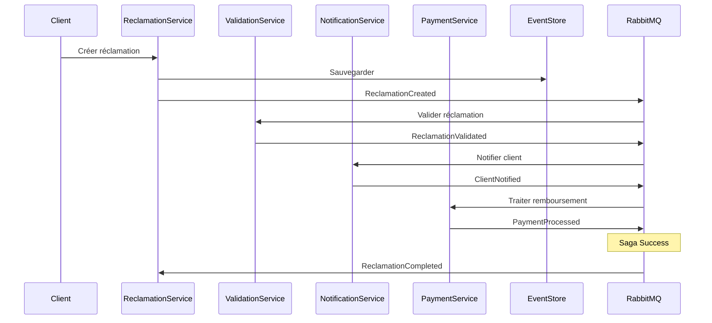

# Analyse du Scénario pour Saga Chorégraphiée - LAB 7 Partie 2

## 📋 Scénario Métier Existant

### Processus Actuel : Gestion des Réclamations
```
1. Client crée une réclamation via API
2. Service Réclamation valide et stocke
3. Événement ReclamationCreated publié
4. Métriques mises à jour
```

## 🎯 Extension pour Saga Chorégraphiée

### Nouveau Scénario : **Processus Complet de Traitement de Réclamation**



## 🔄 Services et Événements Impliqués

### Services Participants
| Service | Responsabilité | Événements Émis | Événements Consommés |
|---------|---------------|------------------|----------------------|
| **ReclamationService** | Gestion réclamations | ReclamationCreated, ReclamationCompleted | ReclamationValidationFailed, PaymentFailed |
| **ValidationService** | Validation business | ReclamationValidated, ReclamationRejected | ReclamationCreated |
| **NotificationService** | Communication client | ClientNotified, NotificationFailed | ReclamationValidated |
| **PaymentService** | Gestion remboursements | PaymentProcessed, PaymentFailed | ClientNotified |

### Événements de la Saga
#### Événements d'Initiation
- `ReclamationCreated` : Démarre la saga

#### Événements de Succès
- `ReclamationValidated` : Validation réussie
- `ClientNotified` : Notification envoyée
- `PaymentProcessed` : Paiement traité
- `ReclamationCompleted` : Saga terminée avec succès

#### Événements de Compensation
- `ReclamationRejected` : Annulation validation
- `NotificationFailed` : Échec notification → Retry
- `PaymentFailed` : Échec paiement → Compensation
- `ReclamationCancelled` : Annulation complète

## 🎭 Patrons de Saga Chorégraphiée

### Happy Path (Succès)
```
ReclamationCreated → ReclamationValidated → ClientNotified → PaymentProcessed → ReclamationCompleted
```

### Compensation Path (Échec)
```
ReclamationCreated → ReclamationValidated → ClientNotified → PaymentFailed → 
NotificationCancelled → ReclamationCancelled
```

## 📊 Métriques à Tracker

### Métriques Saga
- `saga_started_total` : Sagas démarrées
- `saga_completed_total` : Sagas terminées avec succès
- `saga_failed_total` : Sagas échouées
- `saga_compensation_total` : Compensations exécutées
- `saga_duration_seconds` : Durée des sagas

### Métriques par Service
- `validation_success_rate` : Taux de validation
- `notification_delivery_rate` : Taux de livraison notifications
- `payment_success_rate` : Taux de succès paiements

## 🏗️ Architecture Technique

### Topics RabbitMQ Étendus
```
reclamation.events
├── reclamation.created
├── reclamation.validated
├── reclamation.rejected
├── client.notified
├── notification.failed
├── payment.processed
├── payment.failed
└── reclamation.completed
```

### Structure des Événements
```json
{
  "sagaId": "uuid",
  "correlationId": "reclamation-uuid", 
  "eventType": "ReclamationValidated",
  "timestamp": "2025-07-16T18:30:00Z",
  "payload": {
    "reclamationId": "uuid",
    "status": "validated",
    "validatedBy": "system"
  },
  "metadata": {
    "service": "validation-service",
    "version": "1.0.0"
  }
}
```

Cette analyse forme la base pour l'implémentation de la saga chorégraphiée dans les étapes suivantes.
