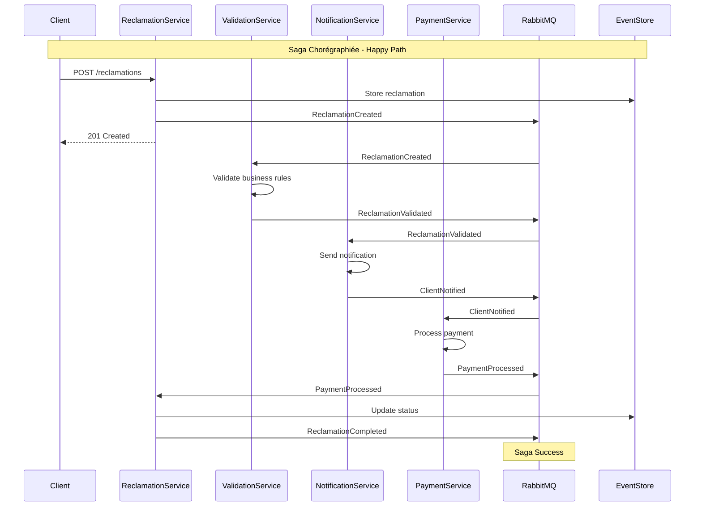
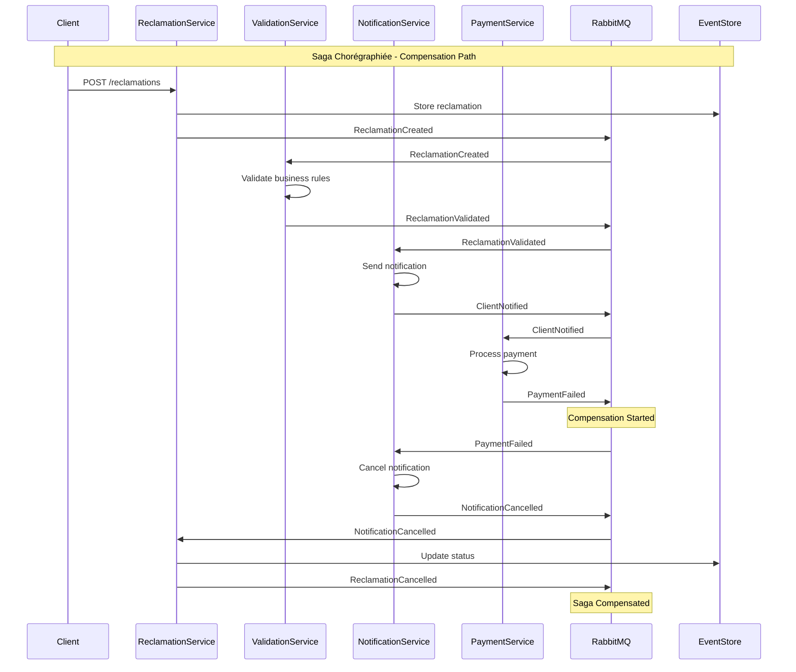
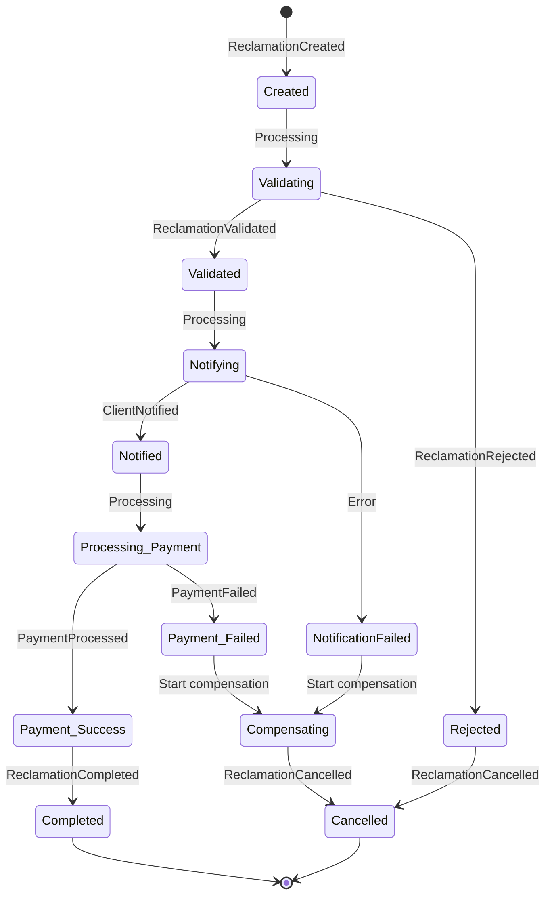

# Conception Saga Chorégraphiée - Processus de Réclamation

## 🎼 Vue d'Ensemble de la Chorégraphie

La saga chorégraphiée coordonne le traitement complet d'une réclamation sans coordinateur central. Chaque service réagit aux événements et décide de la suite du processus.

## 🔄 Flux Global de la Transaction Distribuée

### Phase 1: Initiation (ReclamationService)
```
Client Request → Validate Input → Store Reclamation → Publish ReclamationCreated
```

### Phase 2: Validation Métier (ValidationService)
```
ReclamationCreated → Business Rules Check → Publish ReclamationValidated/Rejected
```

### Phase 3: Notification Client (NotificationService)
```
ReclamationValidated → Send Notification → Publish ClientNotified/NotificationFailed
```

### Phase 4: Traitement Paiement (PaymentService)
```
ClientNotified → Process Refund → Publish PaymentProcessed/PaymentFailed
```

### Phase 5: Finalisation (ReclamationService)
```
PaymentProcessed → Update Status → Publish ReclamationCompleted
```

## 📋 Définition des Événements

### 🚀 Événements d'Initiation

#### ReclamationCreated
```json
{
  "eventType": "ReclamationCreated",
  "sagaId": "saga-uuid-001",
  "correlationId": "reclamation-uuid-001",
  "payload": {
    "reclamationId": "reclamation-uuid-001",
    "clientId": "client-123",
    "type": "REFUND",
    "amount": 99.99,
    "priority": "haute",
    "description": "Produit défectueux"
  },
  "timestamp": "2025-07-16T18:30:00Z"
}
```

### ✅ Événements de Succès

#### ReclamationValidated
```json
{
  "eventType": "ReclamationValidated",
  "sagaId": "saga-uuid-001", 
  "correlationId": "reclamation-uuid-001",
  "payload": {
    "reclamationId": "reclamation-uuid-001",
    "validationResult": "APPROVED",
    "validatedBy": "validation-service",
    "eligibleAmount": 99.99
  }
}
```

#### ClientNotified
```json
{
  "eventType": "ClientNotified",
  "sagaId": "saga-uuid-001",
  "correlationId": "reclamation-uuid-001", 
  "payload": {
    "reclamationId": "reclamation-uuid-001",
    "clientId": "client-123",
    "notificationChannel": "EMAIL",
    "notificationId": "notif-uuid-001"
  }
}
```

#### PaymentProcessed
```json
{
  "eventType": "PaymentProcessed",
  "sagaId": "saga-uuid-001",
  "correlationId": "reclamation-uuid-001",
  "payload": {
    "reclamationId": "reclamation-uuid-001",
    "paymentId": "payment-uuid-001",
    "amount": 99.99,
    "method": "BANK_TRANSFER",
    "status": "COMPLETED"
  }
}
```

### 🔄 Événements de Compensation

#### ReclamationRejected
```json
{
  "eventType": "ReclamationRejected",
  "sagaId": "saga-uuid-001",
  "correlationId": "reclamation-uuid-001",
  "payload": {
    "reclamationId": "reclamation-uuid-001",
    "rejectionReason": "INSUFFICIENT_EVIDENCE",
    "rejectedBy": "validation-service"
  }
}
```

#### PaymentFailed
```json
{
  "eventType": "PaymentFailed",
  "sagaId": "saga-uuid-001",
  "correlationId": "reclamation-uuid-001",
  "payload": {
    "reclamationId": "reclamation-uuid-001",
    "failureReason": "INSUFFICIENT_FUNDS",
    "retryable": true,
    "compensationRequired": true
  }
}
```

#### NotificationCancelled (Compensation)
```json
{
  "eventType": "NotificationCancelled",
  "sagaId": "saga-uuid-001",
  "correlationId": "reclamation-uuid-001",
  "payload": {
    "reclamationId": "reclamation-uuid-001",
    "originalNotificationId": "notif-uuid-001",
    "cancellationReason": "PAYMENT_FAILED"
  }
}
```

## 🎯 Diagramme de Séquence - Happy Path



## 🚨 Diagramme de Séquence - Compensation Path



## 🏗️ Architecture de Coordination

### Pattern Chorégraphié vs Orchestré

| Aspect | Chorégraphié (Notre choix) | Orchestré |
|--------|----------------------------|-----------|
| **Coordination** | Décentralisée via événements | Centralisée via orchestrateur |
| **Couplage** | Faible | Fort |
| **Résilience** | Haute (pas de SPOF) | Moyenne (orchestrateur = SPOF) |
| **Complexité** | Distribuée | Centralisée |
| **Observabilité** | Plus complexe | Plus simple |

### États de la Saga



## 📊 Stratégies de Gestion d'Erreur

### 1. Retry avec Backoff Exponentiel
```javascript
const retryPolicy = {
  maxRetries: 3,
  baseDelay: 1000, // 1s
  maxDelay: 10000, // 10s
  exponentialBase: 2
};
```

### 2. Dead Letter Queue
```javascript
const dlqConfig = {
  exchange: 'saga.dlq',
  routingKey: 'failed.events',
  ttl: 86400000 // 24h
};
```

### 3. Circuit Breaker
```javascript
const circuitBreaker = {
  failureThreshold: 5,
  timeout: 60000, // 1min
  resetTimeout: 300000 // 5min
};
```

## 🎯 Points de Décision de la Saga

### Validation Service
```
IF business_rules_valid AND client_eligible THEN
  PUBLISH ReclamationValidated
ELSE
  PUBLISH ReclamationRejected
END
```

### Payment Service
```
IF payment_method_valid AND funds_available THEN
  PUBLISH PaymentProcessed
ELSE
  PUBLISH PaymentFailed
END
```

### Notification Service
```
IF notification_sent_successfully THEN
  PUBLISH ClientNotified
ELSE
  PUBLISH NotificationFailed
END
```

Cette conception définit la structure complète de la saga chorégraphiée pour l'implémentation technique dans la prochaine étape.
